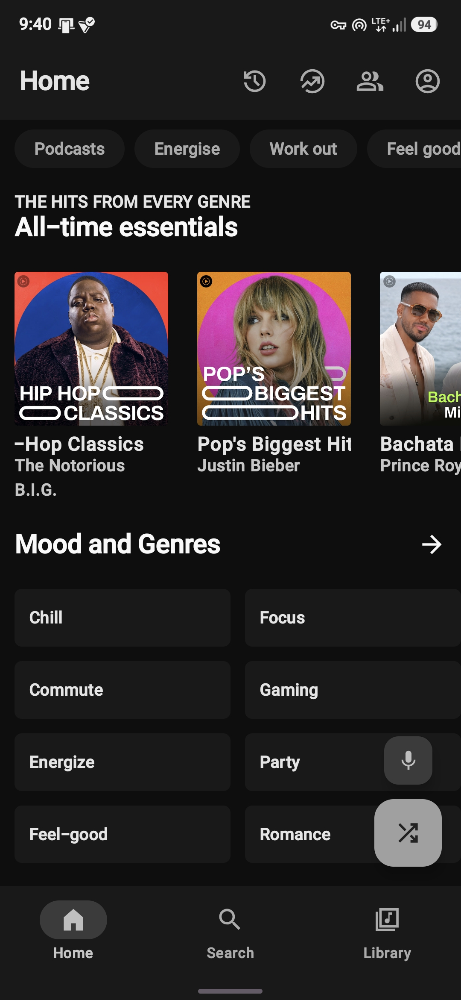
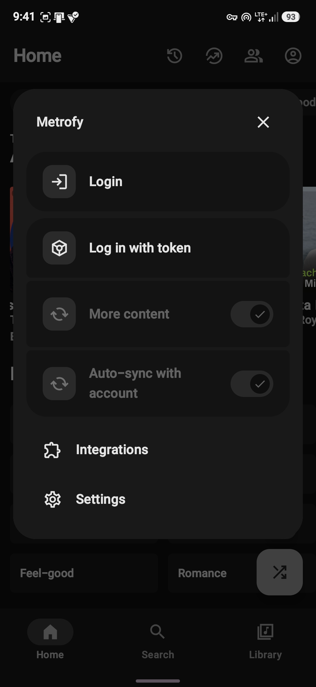
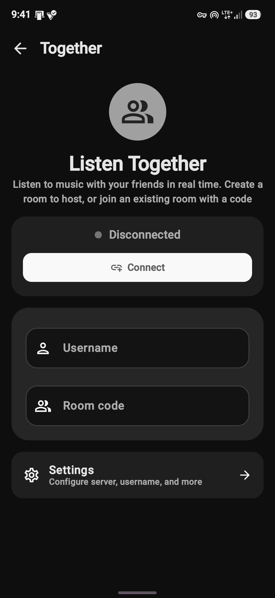
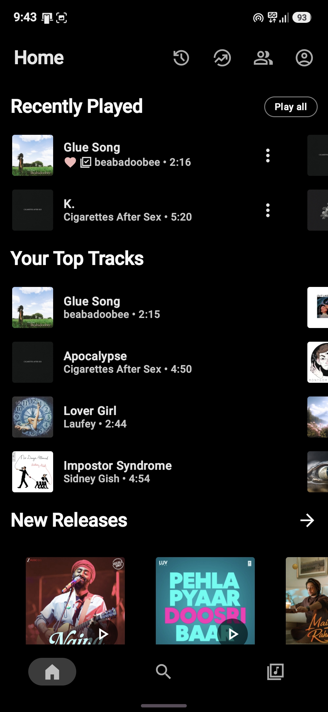
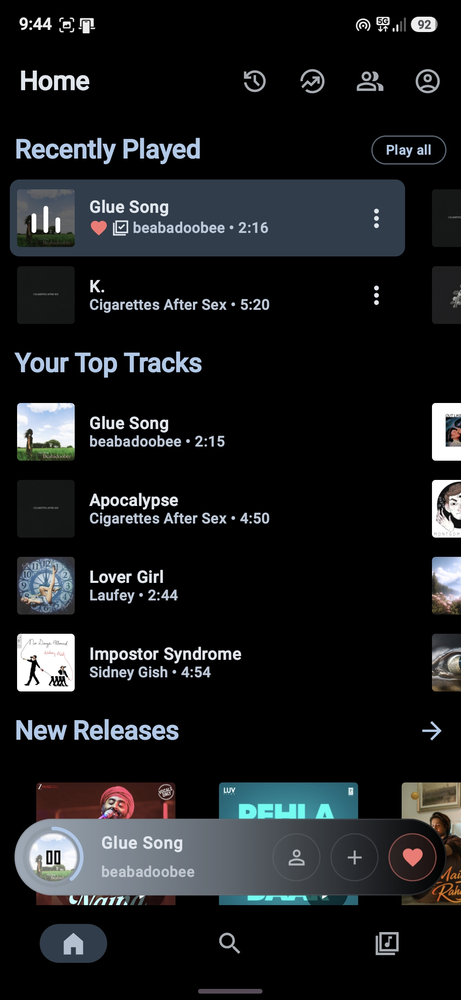
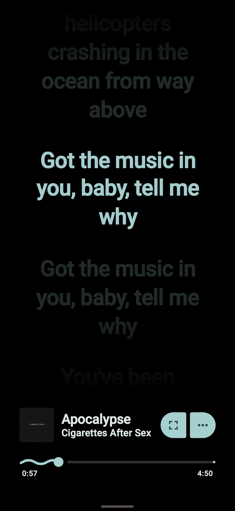

<div align="center">


# Metrofy

**Spotify Canvas, synced lyrics, and YouTube Music — all in one app.**

[](https://github.com/dude555afk/Metrofy/releases/latest)
[](https://github.com/dude555afk/Metrofy/blob/main/LICENSE)

</div>

---

## What is Metrofy?

Metrofy is an Android music app that mixes **Spotify's vibe** — Canvas animations, synced lyrics, personalized picks — with **YouTube Music's massive catalog**. You get Spotify's recommendations and lyrics, but everything actually plays through YouTube Music.

No developer account, no Client ID, no Spotify Premium needed. Just log in and listen.

---

## Why I built this

I wanted an app that feels like Spotify but plays like YouTube Music. Most third-party clients either focus on playback or data, but not both. Metrofy tries to do both without getting in your way.

What it does well:

- **Spotify Canvas** — animated album art while a song plays
- **Synced lyrics** — word-by-word lyrics pulled from Spotify
- **Spotify-powered home & search** — your top tracks, playlists, and recommendations
- **YouTube Music playback** — full YT Music catalog, including rare and live tracks
- **Simple Spotify login** — no extra dashboards or developer setup
- **Listen Together** — real-time shared sessions, recently improved for reconnects
- **Optional lossless audio** — Qobuz FLAC/Hi-Res if you want it, with automatic YouTube fallback

---

## Features

### 🎵 Spotify stuff
- Spotify search and home feed
- Smart queues from your listening history
- Playlists, liked songs, albums, artists
- Manual YouTube match override when the auto-match is wrong
- Spotify album pages with full tracklists

### 🎨 Canvas & Lyrics
- Spotify Canvas animations in the player
- Real-time synced lyrics from Spotify
- Word highlighting while a track plays
- Works for Spotify-matched tracks

### 🎧 Playback
- Background playback
- Search, queue, library, playlists
- Download/cache for offline
- Audio normalization, tempo/pitch control
- Sleep timer, widgets, Discord Rich Presence

### 🤝 Listen Together
- Real-time shared listening
- Better reconnection and rejoin behavior
- Host heartbeat and clean disconnect

### 🎚️ Lossless (Experimental)
- FLAC / Hi-Res via Qobuz
- ISRC-based matching for exact Spotify track resolution
- Multiple resolvers with persistent caching
- Silent YouTube fallback

### 🎨 Looks
- Material 3
- Light / dark / black / dynamic themes
- Android Auto

---

## Screenshots

<div align="center">








</div>

---

## Install

1. Grab the latest **Metrofy.apk** from the [Releases page](https://github.com/dude555afk/Metrofy/releases/latest)
2. Open it on your phone
3. Allow installation from unknown sources if asked
4. Open Metrofy and log in with Spotify

You can install the new APK directly over your existing Metrofy install. Data and settings stay intact.

---

## Setup

### Spotify

1. Open **Metrofy → Settings → Integrations → Spotify**
2. Tap **Login** and sign in with your normal Spotify account
3. Turn on **"Use Spotify for Search"** and/or **"Use Spotify for Home"**
4. Pull to refresh on the home screen

No developer setup, no Client ID. Free or Premium both work.

### Qobuz (Optional)

1. Do Spotify setup first
2. Open **Settings → Integrations → Spotify → Audio quality**
3. Enable **"Use Qobuz for lossless playback"**
4. Pick quality tier, backend, and country code

If Qobuz can't play a track, it quietly falls back to YouTube Music.

---

## Build it yourself

### Prerequisites
- Android Studio Giraffe or newer
- JDK 21
- Android SDK with compileSdk 36

### Secrets
Add to `local.properties`:
```properties
LASTFM_API_KEY=your_key
LASTFM_SECRET=your_secret
```

### Build
```bash
./gradlew assembleFossDebug
```

Output:
```
app/build/outputs/apk/foss/debug/app-foss-debug.apk
```

---

## Changelog

See [`changelog.md`](changelog.md) for full release notes.

Recent updates:
- **Listen Together** reconnection and rejoin fixes
- **Spotify Canvas** and **Spotify Lyrics** support
- **DownloadUtil** crash fixes for malformed streams

---

## FAQ

**Is Metrofy affiliated with Spotify or YouTube?**

No. It's an independent project and not affiliated with Spotify AB, Google LLC, or YouTube.

**Do I need Spotify Premium?**

Nope. Metrofy uses Spotify for data only — recommendations, lyrics, library. Audio streams through YouTube Music, so a free Spotify account works fine.

**Why does playback take a second to start?**

First play initializes the streaming engine and resolves the YouTube match. After that, it's cached locally and much faster. If it's consistently slow, turn off battery optimization for Metrofy in your phone settings.

**Can I use Metrofy without Spotify?**

Yeah. It works as a regular YouTube Music client. Spotify features are optional.

**Why do some songs match to the wrong YouTube version?**

Auto-matching uses title, artist, and duration. It's good, but not perfect — especially for remasters, live versions, or region variants. You can fix it from the player: **⋮ → Change YouTube version**.

**Does Metrofy support Spotify Canvas and lyrics?**

Yes. For Spotify-matched tracks, you'll get Canvas animations and synced lyrics with word highlighting.

**Is Listen Together stable?**

I recently fixed reconnection and rejoin behavior. If you run into issues, try leaving and rejoining, or restart the app.

---

## License

Metrofy is released under the **GPL-3.0** license. See [LICENSE](LICENSE) for details.

---

## Credits

Metrofy is a fork of [Metrolist](https://github.com/MetrolistGroup/Metrolist), originally created by [Mo Agamy](https://github.com/mostafaalagamy).

### Upstream
- **InnerTune** — [Zion Huang](https://github.com/z-huang)
- **OuterTune** — [Davide Garberi](https://github.com/DD3Boh)

### Libraries & Integrations
- [Kizzy](https://github.com/dead8309/Kizzy) — Discord Rich Presence
- [Better Lyrics](https://better-lyrics.boidu.dev) — Synced lyrics
- [SimpMusic Lyrics](https://github.com/maxrave-dev/SimpMusic) — Lyrics API
- [metroserver](https://github.com/MetrolistGroup/metroserver) — Listen Together
- [MusicRecognizer](https://github.com/aleksey-saenko/MusicRecognizer) — Shazam integration

</div>
